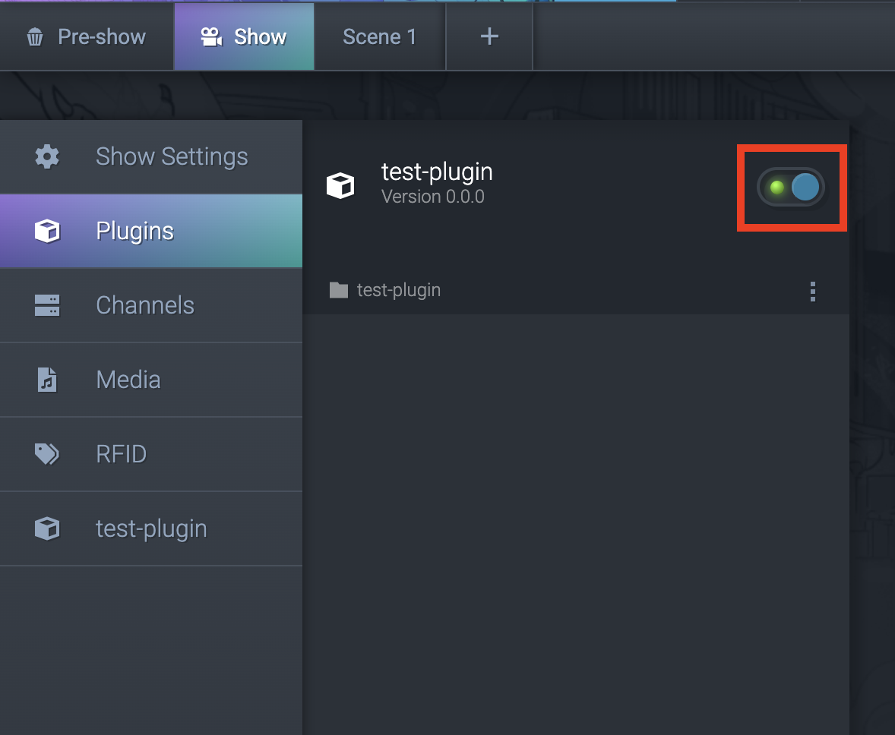
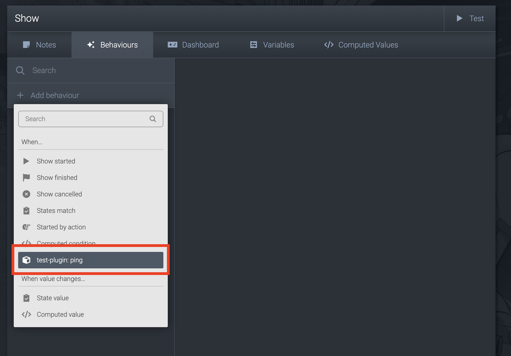
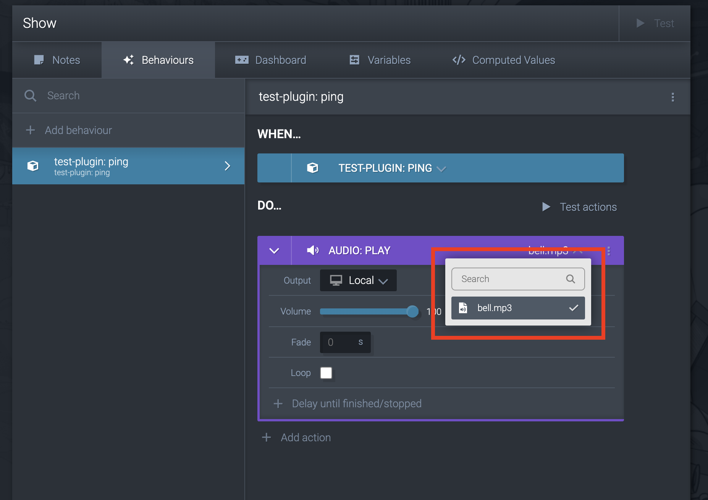
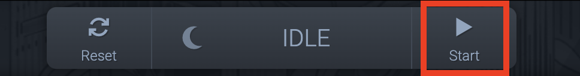

# COGS SDK - Javascript

## [Documentation](https://clockwork-dog.github.io/cogs-sdk/javascript/)

## Quickstart
This guide should get you up and running with a custom COGS plugin in a few minutes.
We'll make an annoying bell that rings every second.

1. Make a new folder for your plugin.
    ```bash
    mkdir plugins/test-plugin
    ```
1. Create a manifest file at `plugins/test-plugin/cogs-plugin-manifest.json`    This tells COGS about your plugin.
    ```json
    {
        "name": "test-plugin",
        "version": "0.0.0",

        "events": {
            "toCogs": [
                {
                    "name": "ding"
                }
            ]
        }
    }
    ```
1. Download the [COGS JavaScript SDK](https://unpkg.com/@clockworkdog/cogs-client) and save it in the plugins folder.
    ```bash
    # macOS / Linux
    curl -L -o plugins/test-plugin/cogs-client.js https://unpkg.com/@clockworkdog/cogs-client
    ```
    > Avoid `<script>` tags with `http...` so your content works without an internet connection.
1. Add an index file at `plugins/test-plugin/index.html`.    This is the logic of your plugin.
    ```html
    <html>
        <head>
            <script src="./cogs-client.js"></script>
        </head>
        <body>
            <script type="module">
                const { CogsConnection, CogsAudioPlayer } = COGS;
                const manifest = await (await fetch('./cogs-plugin-manifest.json')).json();
                
                let interval;
                const cogsConnection = new CogsConnection(manifest);
                cogsConnection.addEventListener('open', () => {
                    interval = setInterval(() => {
                        cogsConnection.sendEvent('ding')                        
                    }, 1000);
                });
                cogsConnection.addEventListener('close', () => {
                    clearInterval(interval);
                });
            </script>
        </body>
    </html>
    ```
1. Download a sound to play, and put it in the `/assets` folder.
    > You could also use [our bell sound](./assets/quickstart-bell.mp3).
1. Enable your plugin in COGS.

    
1. Create a behaviour to listen to the `ding` event.

    
1. Make the behaviour do something.    In this case it'll play our bell sound.

    
1. Start the show!

    

We strongly suggest that for anything more complex you follow our guide using TypeScript and Vite.
TypeScript will make it a lot easier to know why things go wrong, and Vite will make developing a lot quicker with hot reloading.

## Using Typescript & Vite

### NPM / Yarn

Then add `cogs-client` with NPM or Yarn:

```bash
npm install --save @clockworkdog/cogs-client
# OR
yarn add @clockworkdog/cogs-client
```

## Usage

### Create a `cogs-plugin-manifest.js` file

See [CogsPluginManifestJson](https://clockwork-dog.github.io/cogs-sdk/javascript/interfaces/CogsPluginManifestJson.html) for details of what to include.

If using Typescript set `"allowJs": true` in your `tsconfig.json`.

Use the `@type {const}` JSDoc annotation to allow the manifest to be imported as a literal type and `@satisfies {import("@clockworkdog/cogs-client").CogsPluginManifest}` to allow your editor to check the validity of the manifest.

e.g.

```js
module.exports =
    /**
     * @type {const}
     * @satisfies {import("@clockworkdog/cogs-client").CogsPluginManifest}
     */
    ({
        name: 'Big Button',
        icon: 'bullseye-pointer',
        description: 'A big, colorful touchscreen button',
        version: '1',
        config: [
            {
                name: 'Color',
                value: { type: 'string', default: 'red' },
            },
        ],
        state: [
            {
                name: 'Enabled',
                value: { type: 'boolean', default: false },
                writableFromCogs: true,
            },
        ],
        events: {
            toCogs: [
                {
                    name: 'Pressed',
                    value: { type: 'boolean' },
                },
            ],
            fromCogs: [
                {
                    name: 'Explosion',
                },
            ],
        },
        media: {
            audio: true,
            video: true,
            images: true,
        },
    });
```

### Import the library

#### Browser

```js
const { CogsConnection, CogsAudioPlayer } = COGS;
```

#### Javascript

```js
const { CogsConnection, CogsAudioPlayer } = require('@clockworkdog/cogs-client');
```

#### Typescript / ES6

```ts
import { CogsConnection, CogsAudioPlayer } from '@clockworkdog/cogs-client';
```

### Connect to COGS

Initialize a [CogsConnection](https://clockwork-dog.github.io/cogs-sdk/javascript/classes/CogsConnection.html) with the manifest you created above.

```ts
let connected = false;

import * as manifest from './cogs-plugin-manifest.js'; // Requires `"allowJs": true` in `tsconfig.json`

const cogsConnection = new CogsConnection(manifest);
cogsConnection.addEventListener('open', () => {
    connected = true;
});
cogsConnection.addEventListener('close', () => {
    connected = false;
});
cogsConnection.addEventListener('config', ({ config }) => {
    // Handle new config
    // `config` is of type `{ [name: string]: number | string | boolean }`
});
cogsConnection.addEventListener('state', ({ state }) => {
    // Handle state updates
    // `state` is of type `{ [name: string]: number | string | boolean }`
});
cogsConnection.addEventListener('event', ({ name, value }) => {
    // Handle events from COGS
    // `name` is the event name.
    // `value` is of the type defined in manifest, one of `number | string | boolean | undefined`.
});
cogsConnection.addEventListener('message', ({ message }) => {
    // Handle low-level COGS messages. See `types/CogsClientMessage.ts`
});

function sendEventToCogs() {
    cogsConnection.sendEvent('Hello');
}

function sendPortUpdateToCogs() {
    cogsConnection.setState({ port1: 100 });
}
```

You can save arbitrary data to COGS which will be restored when reconnecting with COGS:

```ts
const cogsConnection = new CogsConnection(manifest, undefined, undefined, {
    // Initial items in the store
    'my-key': { foo: 0, bar: '' },
});

// Update the store
cogsConnection.store.setItems({ 'my-key': { foo: 1, bar: 'two' } });

// Get item from data store
cogsConnection.store.items.getItem('my-key');

// Listen for data changes
cogsConnection.store.addEventListener('item', ({ key, value }) => {
    console.log(key, 'item changed:', value);
});
cogsConnection.store.addEventListener('items', ({ items }) => {
    console.log('items changed:', items);
});
```

### Support audio actions

Add `audio` to `cogs-plugin-manifest.js`:

```js
{
    media: {
        audio: true;
    }
}
```

Add [CogsAudioPlayer](https://clockwork-dog.github.io/cogs-sdk/javascript/classes/CogsAudioPlayer.html) to your page:

```ts
const audioPlayer = new CogsAudioPlayer(cogsConnection);

// Optional
audioPlayer.addEventListener('state', (audioState) => {
    // Handle audio state changes. See `types/AudioState.ts`
});
```

### Local development

When developing locally you should connect to COGS in "simulator" mode by appending `?simulator=true&t=media_master&name=MEDIA_MASTER_NAME` to the URL. Replace `MEDIA_MASTER_NAME` with the name of the Media Master you set in COGS.

For example, with your custom content hosted on port 3000, http://localhost:3000?simulator=true&t=media_master&name=Timer+screen will connect as the simulator for `Timer screen`.
